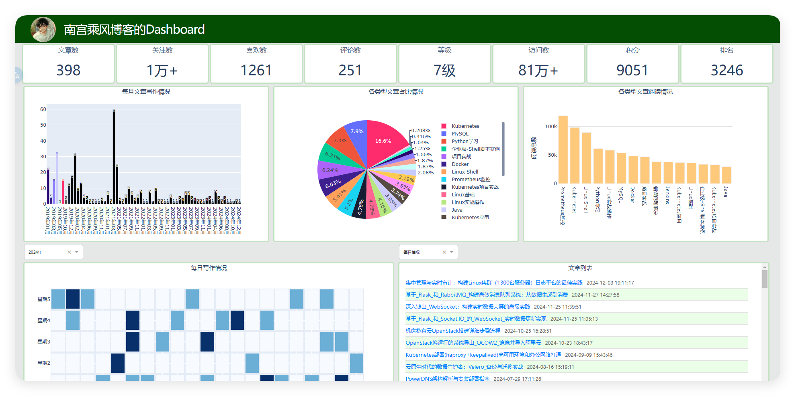

# CSDash

> **CSDash** 是一个基于 Python 和 [Dash](https://dash.plotly.com/) 构建的开源大屏展示系统，旨在帮助开发者快速构建动态数据可视化大屏。通过简洁的代码和强大的功能，CSDash
> 能够轻松支持数据监控、实时展示以及复杂的图表布局。

------

## 功能特点

- 🌟 **模块化布局**：支持多种图表模块（折线图、柱状图、饼图等）。
- 🔄 **实时数据刷新**：通过 API 接口或本地数据源更新大屏内容。
- 📊 **多种图表支持**：内置丰富的图表类型，支持高度定制化。
- 🎨 **主题化支持**：提供多种大屏主题，可自由切换。
- 🚀 **易于扩展**：基于 Dash 框架，轻松扩展新功能。

------

## 示例效果

------
## 技术栈
- 语言：Python 3.7+
- 框架：Dash
- 可视化：Plotly
- 其他依赖：Pandas、NumPy 等

------